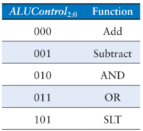

# Atividade 7

A sétima atividade é incluir o arquivo `alu.vhd` ao projeto, defini-lo como toplevel, e obter os resultados de compilação.

Para implementação da alu é necessário implementar uma função sobrecarregando o operador **"+"**, utilizando o projeto adder, para realizar a operação de soma entre dois operandos do tipo **bit_vector**, que não é definido para o operador **"+"**. Também é necessário sobrecarregar o operador **"-"**, para realizar a operação de subtração entre dois operandos do tipo **bit_vector**.

O arquivo `alu.vhd` deve implementar uma unidade lógica aritmética que realize as seguintes operações com operando de **N** bits, de valor *default* de **32**, de acordo com o valor de **ALUControl**:

As entradas da alu devem ser nomeadas **A**, **B** e **ALUControl**, e as saídas **Result** e **Zero**.

Enviar o arquivo `.VHD` e o arquivo `riscvsingle.fit.rpt` da alu implementada.