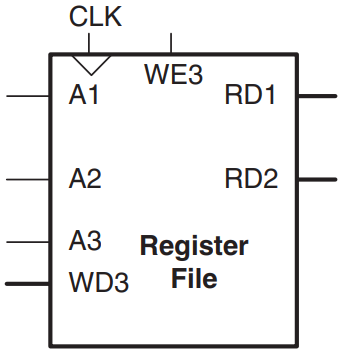

# Atividade 9

A nona atividade é incluir o arquivo `regfile.vhd` ao projeto, defini-lo como toplevel, e obter os resultados de compilação.

O arquivo `regfile.vhd` deve implementar um banco de **32** registradores de **N** bits, com valor *default* de **32**.

O banco de registradores deve ter as entradas **A1**, **A2**, **A3**, **WD3**, **WE3** e **clk**, e as saídas **RD1** e **RD2**:

- **A1**: **5** bits oriundos do campo **rs1** e indica o endereço do registrador de **32** bits a ser lido em **RD1**;

- **A2**: **5** bits oriundos do campo **rs2** e indica o endereço do registrador de **32** bits a ser lido em **RD2**;

- **A3**: **5** bits oriundos do campo **rd** e indica o endereço do registrador de **32** bits a ser escrito em **WD3**;
- **WE3**: bit de controle para permitir a escrita no banco de registradores;
- **clk**: bit de controle para ativar o banco de registradores.

Incluir no pacote `riscv_pkg` a declaração de componente da entidade `regfile` e uma função que faça a conversão de **bit_vector** para **integer**.

Enviar os arquivos `.VHD` (`riscv_pkg.vhd` e `regfile.vhd`) e o arquivo `riscvsingle.fit.rpt` da compilação do banco de registradores implementado.