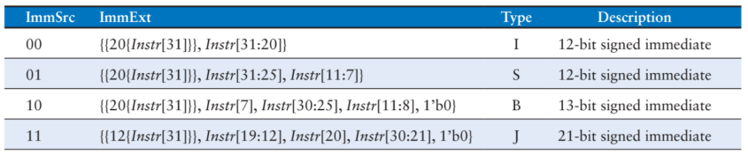

# Atividade 10

A décima atividade é criar uma entidade chamada *extend* (arquivo `extend.vhd`), na pasta `src`, e inclui-lo no projeto *riscvsingle*, defini-lo como *toplevel*, e obter os resultados de compilação. A sua declaração de componente deve ser incluída no pacote `riscv_pkg.vhd`.

O arquivo `extend.vhd` deverá implementar um decodificador de valores imediatos, sendo a entrada de controle nomeada `immsrc`, de **dois bits**, que indica qual a origem do valor imediato (de acordo com a tabela abaixo), a entrada de dados nomeada `instr`, de **25 bits** (apenas os 25 bits mais significativos da instrução, de 7 a 31, são necessários), que carrega as informações dos valores imediatos, e de saída de dados nomeada `immext`, que corresponde ao valor imediato de **32 bits**.



Utilize *alias* para indicar cada parte que forma o valor imediato, em função do tipo de instrução. Por exemplo, para o imediato para a instrução tipo I, o *alias* seria:

```
alias I_sign: bit is instr(31);							-- bit de sinal do valor imediato da instrução do tipo I
alias I_imm: bit_vector(11 downto 0) is instr(31 downto 20);	-- valor imediato da instrução do tipo I
```

Vale a pena lembrar que todos os valores imediatos são "*signed extended*".

Sugestão: utilize case e concatenação.

Enviar os arquivos .VHD e o arquivo `riscvsingle.fit.rpt` do decodificador implementado.