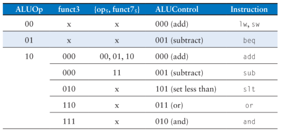

# Atividade 11

A décima primeira atividade é criar uma entidade chamada *aludec* (arquivo `aludec.vhd`), na pasta `src`, e inclui-lo no projeto *riscvsingle*, defini-lo como *toplevel*, e obter os resultados de compilação. A sua declaração de componente deve ser incluída no pacote `riscv_pkg.vhd`.

O arquivo `aludec.vhd` deverá implementar um decodificador de controle da ALU, com as seguintes entradas de controle:

- `ALUOp`, de **dois bits**, que indica qual o tipo de instrução que solicita a execução da ALU
- `funct3`, de **3 bits**, que indica qual operação será executada pela ALU, em conjunto com os bit:
- - `opb5`, o **bit 5** do campo `opcode` da instrução
- - `funct7b5`, o **bit 5** do campo `funct7` da instrução

A saída de dados nomeada *ALUControl*, de **3 bits**, controlará a ALU.

Sugestão: utilize case.

Enviar os arquivos .VHD e o arquivo `riscvsingle.fit.rpt` do decodificador implementado.