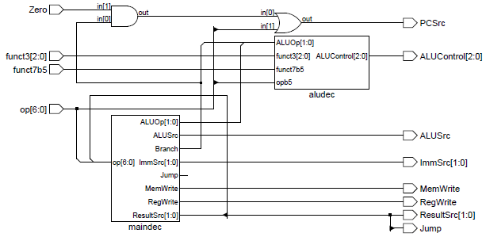
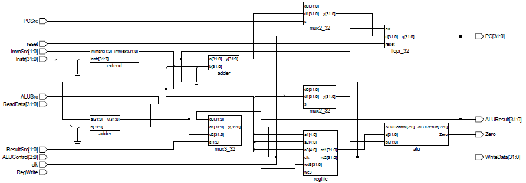
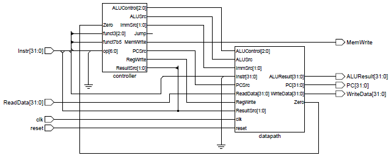
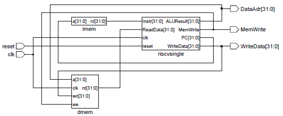
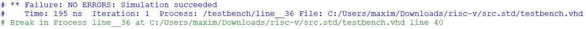
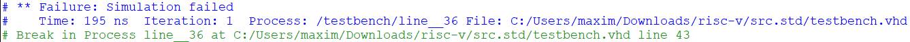
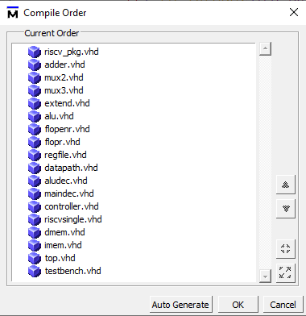

# Atividade 12

Esta atividade tem por objetivo fazer a integração de todos os componentes desenvolvidos até o momento para a implementação de uma arquitetura baseada num ISA mínimo do RISC-V (RV32I). Esta atividade deverá ser realizada em partes para garantir o correto funcionamento da implementação.

## Primeira parte - desenvolvimento do Controlador

O Controlador (`controller.vhd`) é formado pelo controlador da ALU (`aludec.vhd`) e do Decodificador de Instruções (`maindec.vhd`). A função do Decodificador de Instruções é gerar os sinais de controle do *Datapath*, do controlador da ALU e das memórias. O controlador da ALU, por sua vez, realiza o controle da ALU, de acordo com a instrução a ser executada. Na figura 1 temos o diagrama do Controlador.

> Figura 1 - Controlador, formado pelo Decodificador de Instruções e Controlador da ALU

## Segunda parte - desenvolvimento do *Datapath*

O *Datapath* (`datapath.vhd`), por sua vez, é responsável pela execução das instruções, de acordo com os sinais de controle do Controlador. Ele é formado principalmente pela ALU (`alu.vhd`) e pelo Banco de Registradores (`regfile.vhd`). Os demais componentes (`mux2`, `mux3`, `adder`, `flopr`, `extend`) auxiliam na execução das instruções. Na figura 2 temos o diagrama do *Datapath*.

> Figura 2 - *Datapath*, formado principalmente pelo Banco de Registradores e pela ALU

## Terceira parte - Desenvolvimento do Processador

A integração do Controlador com o *Datapath* forma a arquitetura do processador RISC-V Single (`riscvsingle.vhd`), que implementa a versão de ciclo único (cada instrução é executada em um único ciclo de clock) do ISA mínimo do RISC-V (RV32I). Na figura 3 temos o diagrama do processador.

> Figura 3 - Riscvsingle, formado pelo Controlador e pelo *Datapath*

## Quarta parte - Integração com as memórias

Para que o Processador possa ser utilizado, é necessário interligá-lo com as memórias de instruções (`imem.vhd`) e de dados (`dmem.vhd`). A memória de instruções contém um pequeno código que será utilizado para testar o processador. Na figura 4 temos a integração do Processador com as Memórias (`top.vhd`).

> Figura 4 - Integração do Processador riscvsingle com as memórias de instrução e de dados

Todas estas atividades devem ser realizadas no Quartus, garantindo o correto funcionamento dos componentes.

## Quinta atividade - Simulação do Processador.

Para realizar a simulação do processador, o arquivo testbench.vhd solicitará o processador `top.vhd` como componente, gerará os sinais de clock e de reset, e verificará se, depois de **200 ns** o projeto executou corretamente as instruções contidas na memória de instruções (`imem.vhd`). Se tudo ocorrer corretamente, será visualizada esta mensagem no console do Modelsim:

Caso contrário, será visualizada esta mensagem:

Esta última parte deverá ser realizada no ModelSim. Todos os arquivos deverão ser incluídos, e a seguinte ordem de compilação deverá ser anotada (figura 5):

> Figura 5 - Ordem de compilação no ModelSim

OBS: No Quartus, a variável "*Auto RAM Replacement*" deverá ser configurada para "*Off*".

OBS: Todas as declarações de componentes dos arquivos em anexo deverão ser inseridas no pacote `riscv_pkg.vhd`.
